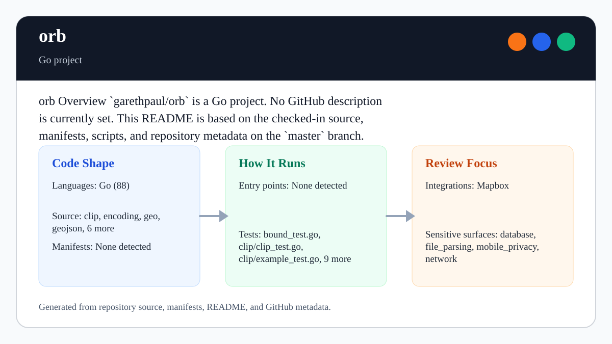

# orb

<!-- README-OVERVIEW-IMAGE -->


## Overview

`garethpaul/orb` is a Go project. The checked-in files describe a Go project with the structure summarized below.

This README is based on the checked-in source, manifests, scripts, and repository metadata on the `master` branch. The project language mix found during review was: Go (88).

## Repository Contents

- `.gitignore` - local secrets, logs, coverage, and generated-output ignores
- `CHANGES.md` - baseline change log
- `Makefile` - local verification entry point
- `README.md` - project overview and local usage notes
- `go.mod` - Go module metadata for `github.com/paulmach/orb`
- `go.sum` - Go dependency checksums
- `clip` - source or example code
- `encoding` - source or example code
- `geo` - source or example code
- `geojson` - source or example code
- `internal` - source or example code
- `maptile` - source or example code
- `planar` - source or example code
- `project` - source or example code
- `quadtree` - source or example code
- `resample` - source or example code
- `scripts/check-baseline.py` - static baseline checks used by `make check`
- `SECURITY.md` - security reporting and disclosure guidance
- `docs/plans/2026-06-08-orb-go-module-baseline.md` - completed module hardening plan

Additional scan context:

- Source directories: clip, encoding, geo, geojson, internal, maptile, and 4 more
- Dependency and build manifests: none detected
- Entry points or build surfaces: none detected
- Test-looking files: bound_test.go, clip/clip_test.go, clip/example_test.go, clip/helpers_test.go, clip/smartclip/around_bound_test.go, clip/smartclip/smart_test.go, clip/smartclip/util_test.go, clone_test.go, and 4 more

## Getting Started

### Prerequisites

- Git
- Go 1.20 or newer

### Setup

```bash
git clone https://github.com/garethpaul/orb.git
cd orb
make check
```

The setup commands above are derived from repository files. Legacy mobile, Python, or JavaScript samples may require older SDKs or package versions than a modern workstation uses by default.

## Running or Using the Project

- Import packages using the module path `github.com/paulmach/orb`.
- Read [`docs/go-support.md`](docs/go-support.md) before changing the minimum Go
  version, module path, dependency graph, generated protobuf surfaces, or fixed
  hosted toolchains.
- This repository is a library, not a standalone service. Start with the package
  READMEs under `geo`, `geojson`, `encoding`, `clip`, and `maptile`.
- Run `make check` before changing geometry algorithms, encoders, generated
  protobuf code, or fixture data.
- `make lint`, `make build`, and `make verify` are stable aliases for the Go
  vet, build-through-test, and full verification gates.
- Standard Make aliases resolve Go and checker paths from `Makefile`, so an
  absolute Makefile path works from another directory without changing gates.
- Core ring helpers treat degenerate rings as non-closed or zero-orientation
  inputs instead of panicking.
- `LineString.Reverse` handles empty line strings without panicking.
- `Collection.Dimensions` skips nil geometries and keeps all-nil collections at
  the same empty dimension result.
- `Bound.Union` treats empty receiver bounds and empty union arguments as
  identity values so aggregate bounds do not inherit the empty bound sentinel.
- `Bound.IsEmpty` treats malformed negative bounds as empty while preserving
  zero-area bounds, such as single points or horizontal and vertical segments,
  as valid bounds.
- Simplification skips empty polygons inside multipolygons without panicking.
- `MultiPolygon.Bound` keeps leading empty polygons from leaking empty-bound
  sentinels into aggregate bounds.
- Empty interval resampling returns empty line strings before distance
  precomputation, avoiding negative slice sizes and callback execution.
- Non-finite interval distances are rejected before distance callbacks or
  point-count conversion, preventing malformed numeric input from panicking.
- Nonfinite or integer-overflowing derived point counts are rejected before
  integer conversion or output allocation.
- Planar containment treats empty rings and polygons as non-containing inputs
  instead of panicking.
- `planar.DistanceFromWithIndex` returns the matching polygon ring index rather
  than leaking a segment index; empty polygons remain `+Inf, -1`.

## Testing and Verification

- `make check`
- `make lint`
- `make build`
- `make verify`
- `go test ./...`
- `go test -race ./...`
- `go vet ./...`
- `python3 scripts/check-baseline.py`
- Pinned hosted Linux validation uses a read-only, credential-free checkout and
  runs the full gate, including the race detector, on Go 1.20.14 and Go 1.25.11
  with toolchain auto-upgrades disabled.
- Go 1.20 is the declared compatibility minimum; Go 1.20.14 is its fixed final
  patch lane, while Go 1.25.11 is patched modern-toolchain validation rather than a
  raised minimum or blanket promise for future releases.

When the required SDK or runtime is unavailable, use static checks and source review first, then verify on a machine that has the matching platform toolchain.

## Configuration and Secrets

- Detected references to Mapbox. Keep API keys, OAuth credentials, tokens, and account-specific values in local configuration only.

## Security and Privacy Notes

- Review changes touching network requests, sockets, or service endpoints; examples from the scan include LICENSE.md, clip/clip.go, encoding/mvt/clip.go, encoding/mvt/layer.go, and 1 more.
- Review changes touching file, media, JSON, XML, CSV, OCR, or data parsing; examples from the scan include encoding/mvt/geometry.go, encoding/mvt/geometry_test.go, encoding/mvt/marshal_test.go, encoding/mvt/vectortile/vector_tile.pb.go, and 6 more.
- Review changes touching database, model, or persistence code; examples from the scan include encoding/wkb/scanner.go.
- Mapbox Vector Tile support depends on generated protobuf code under
  `encoding/mvt/vectortile`; keep the `.proto`, generated `.pb.go`, and tests
  in sync.
- Degenerate rings and malformed geometry inputs should fail predictably rather
  than panic in caller pipelines.
- Empty line strings should remain safe for helper methods such as reverse.
- Nil geometries inside collections should be ignored by aggregate helpers.
- Empty bounds should remain identity values in bound union helpers.
- Zero-area bounds should remain valid instead of being treated as empty
  malformed bounds.
- Empty polygons inside multipolygons should be skipped by simplification
  helpers instead of panicking.
- Leading empty polygons should remain safe in multipolygon bound aggregation.
- Empty rings and polygons should be rejected by planar containment helpers
  instead of panicking.
- Non-finite interval distances should remain rejected before resampling
  calculations or caller-provided distance callbacks.

## Maintenance Notes

- The Go module path is `github.com/paulmach/orb`, matching the imports already
  used throughout the source tree.
- See `CHANGES.md` and `docs/plans/2026-06-08-orb-go-module-baseline.md` for
  the current module baseline.
- See `SECURITY.md` for vulnerability reporting and safe research guidance.
- See `VISION.md` for project direction and contribution guardrails.

## Contributing

Keep changes small and tied to the project that is already present in this repository. For code changes, document the toolchain used, avoid committing generated dependency directories or local configuration, and update this README when setup or verification steps change.
